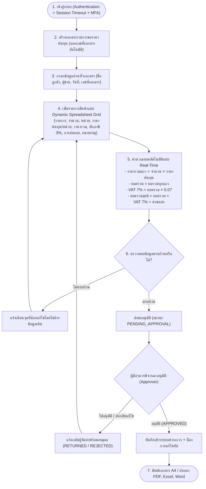

# PriceCraf Workflow Flowchart (PROTEX GROUP)

แผนผังการทำงานของระบบบริหารรายการขอราคาต้นทุนสินค้าและการอนุมัติเอกสาร

```mermaid
flowchart TD
    A(["1. เข้าสู่ระบบ (Authentication + Session Timeout + MFA)"]) --> B["2. สร้างเอกสารรายการขอราคาต้นทุน (ออกเลขที่เอกสารอัตโนมัติ)"]
    B --> C["3. กรอกข้อมูลส่วนหัวเอกสาร (ชื่อลูกค้า, ผู้ขาย, วันที่, เลขที่เอกสาร)"]
    C --> D["4. เพิ่มรายการสินค้าแบบ Dynamic Spreadsheet Grid\n(รายการ, จำนวน, หน่วย, ราคาต้นทุน/หน่วย, ราคารวม, หักภาษี 3%, การส่งมอบ, หมายเหตุ)"]
    D --> E["5. คำนวณยอดอัตโนมัติแบบ Real-Time\n- ราคารวมแถว = จำนวน × ราคาต้นทุน\n- ยอดรวม = ผลรวมทุกแถว\n- VAT 7% = ยอดรวม × 0.07\n- ยอดรวมสุทธิ = ยอดรวม + VAT 7% + ค่าขนส่ง"]
    E --> F{"6. ตรวจสอบข้อมูลครบถ้วนหรือไม่?"}
    F -- "ไม่ครบถ้วน" --> G["แจ้งเตือนจุดที่ต้องแก้ไขโดยไม่ล้างข้อมูลเดิม"]
    G --> D
    F -- "ครบถ้วน" --> H["ส่งขออนุมัติ (สถานะ PENDING_APPROVAL)"]
    H --> I{"ผู้มีอำนาจพิจารณาอนุมัติ (Approver)"}
    I -- "ไม่อนุมัติ / ส่งกลับแก้ไข" --> J["แจ้งกลับผู้จัดทำพร้อมเหตุผล (RETURNED / REJECTED)"]
    J --> D
    I -- "อนุมัติ (APPROVED)" --> K["บันทึกเข้าระบบอย่างถาวร + ล็อกการแก้ไขทับ"]
    K --> L(["7. พิมพ์เอกสาร A4 / ส่งออก PDF, Excel, Word"])
```

